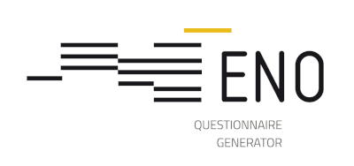

# Eno – Questionnaire generator

[Release description](https://github.com/InseeFr/Eno/tree/master/docs/releases.md)

## What is it ?

**Eno** is a tool that **generates survey questionnaires starting from their formal description** in [DDI](http://ddialliance.org). 
It automates the production of **“collection instruments”** (paper or web forms, collection modules for surveyors, etc.) based on a formal and abstract description of the questionnaire as standardised metadata. 
These models are then used to produce the collection media, in **different modes**, within production collection infrastructures. 

Starting DDI, Eno generates  : 
- **an Xforms output format**, viewable with [Orbeon](https://www.orbeon.com/), and intended for web collection. Insee has developed an data collection services for XForms questionnaires powered by Orbeon : [Stromae](https://github.com/InseeFr/Stromae).
- **an FO output format**, which can be transformed into PDF with the Apache FOP engine, and intended for paper collection.
- **a Lunatic XML output format**, which is transformed into Json with the [Lunatic-model](https://github.com/InseeFr/Lunatic-model), which is associated with the library of javascript components [Lunatic](https://github.com/InseeFr/Lunatic), and encapsulated in a JS application (orchestrator) deployable. [An Example of orchestrator](https://github.com/InseeFr/Queen)
- **An fodt output format**, which is a specification in fod format, for documentation, or questionnaire design purposes.

Eno is used by Insee since 2015 : more than 30 business surveys are using Eno for their web and paper questionnaires, and the offer for household surveys is growing.

ENO is often associated with [**Pogues**](https://github.com/InseeFr/Pogues). This is is an additional module to Eno, **a questionnaire design user interface**, that connects with the generation process. Pogues produces the DDI description of the questionnaire : using this tool, a questionnaire designer can specify his web questionnaire in a friendly way and visualize the generated result in one click.

## How to get it ?

Eno is published as open source on GitHub. It is available under the **MIT license**, and contributions as well as suggestions for improvements are welcome.

It is developped in an international perspective, codes and comments are in english. Data of course can be collected in any langage.

## How to use it ?

Eno comes packaged in a **REST web service using [Eno-WS](https://github.com/InseeFr/Eno-WS)** and a Docker image. 

## Example : 
 
You can find on the subdirectory [/questionnaire/], the questionnaire example "Simpsons" specified in the DDI format.

You can find a platform of demonstration on [Docker image](https://eno.dev.insee.io).

## Road Map

Eno is very widely, even systematically, used in business surveys (web questionnaire, paper questionnaire, takeover and management tool). 

Household surveys have also started to use it and work is underway to increase the functional coverage required for these surveys (e.g. description of filters, possibility to loop or select occurrences of a loop, interviewer questionnaire).
