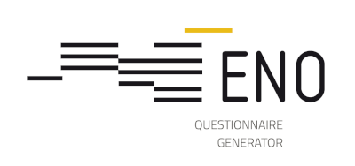

<!--@nrg.languages=en,fr-->
<!--@nrg.defaultLanguage=en-->

# Eno

${en:'Eno is a tool designed to transform questionnaires from their formal description in [DDI](https://ddialliance.org/) to different formats for data collection operations.', fr:"Eno est un outil de transformation de questionnaires, à partir de leur description formelle en [DDI](https://ddialliance.org/), vers différents formats destinés aux opérations de collecte"}

${en:'From a DDI, Eno produces:', fr:"À partir d'un DDI, Eno peut produire :"}

- ${en:'A [Lunatic](https://github.com/InseeFr/Lunatic) questionnaire that can be used for web, telephone or face to face interviewing.', fr:'Un questionnaire [Lunatic](https://github.com/InseeFr/Lunatic) pour la collecte web, téléphone et face à face.'}
- ${en:'A questionnaire in paper format.', fr:'Un questionnaire au format papier.'}
- ${en:'A description of the questionnaire in an editable file.', fr:'Un fichier de description de questionnaire, dans un format éditable.'}

${en:'Eno is used by [Pogues](https://github.com/InseeFr/Pogues), a questionnaire design user interface. Eno converts Pogues output into a DDI.', fr:'Eno est utilisé par [Pogues](https://github.com/InseeFr/Pogues), une interface de saisie de questionnaire. Eno convertit la saisie Pogues en DDI.'}

${en:'Eno is a part of the [Bowie](https://github.com/InseeFr/Bowie) product.', fr:'Eno est une composante du produit [Bowie](https://github.com/InseeFr/Bowie).'}

## Documentation

${en:'The documentation can be found in the [docs](./docs/en) folder and [browsed online](https://inseefr.github.io/Eno).', fr:'La documentation se trouve dans le dossier [docs](./docs/fr) et peut être [consultée en ligne](https://inseefr.github.io/Eno/fr).'}

## Eno _Java_

${en:'V3 "Eno Java" project: change of technology from XSLT to Java.', fr:'Projet V3 "Eno Java" : changement de technologie de XSLT vers Java.'}

## ${en:'Setup', fr:'Configuration'}
[Setup](./README.md#Setup)<!--fr-->

### Requirements<!--en-->

- JDK 21+<!--en-->
- Maven 3+<!--en-->
